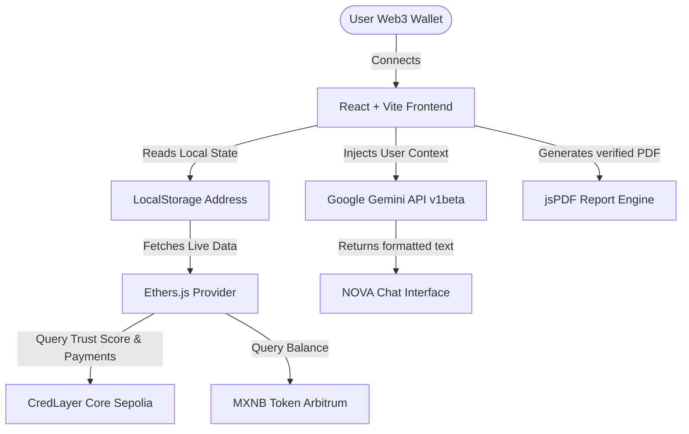

# CredLayer AI

## Portable Financial Reputation Infrastructure for LATAM
**Built for Ethereum México Hackathon**

---

# Overview

CredLayer AI is a financial intelligence and portable reputation platform designed for small businesses, freelancers, and informal commerce communities across LATAM.

The platform transforms everyday financial activity into a verifiable and portable financial reputation using Ethereum infrastructure, stablecoins, and AI-powered analytics.

Instead of replacing banks, CredLayer AI creates an alternative trust layer for people traditionally ignored by the financial system.

The experience is designed to feel like a modern fintech platform while Ethereum works invisibly in the background.

---

# Core Vision

> **"CredLayer AI turns everyday financial activity into portable trust."**

The goal is to help millions of people and small businesses in LATAM prove financial stability, operational consistency, and economic activity through blockchain-backed verification and AI analysis.

---

# Platform Summary & Features

### 1. Verifiable Payment Records
Users can:
* Register incoming and outgoing payments.
* Store verification hashes on-chain.
* Create immutable financial history.
* Verify transactions transparently.
* Supported assets: **USDC** (Ethereum Sepolia) and **MXNB** (Arbitrum Sepolia).

### 2. NOVA AI Assistant
An integrated financial intelligence assistant that:
* Reads real-time data directly from the **CredLayer Core** contract (Trust Scores, payment count) and Arbitrum tokens (MXNB balances).
* Provides tailored business and credit advice based on actual on-chain activity.
* Uses direct integration with **Google Gemini API (`gemini-2.5-flash`)** for cost-efficient, high-performance, real-time responses.
* Supports clean markdown parsing (`**negritas**`, `*cursivas*`) on all interfaces.
* Integrated into the main React UI via the `/nova` standalone route and the persistent `<AIAssistantChat />` widget, using the custom `useAiAssistant` React hook. (Static file backup kept at `/IA/index.html`).

### 3. Reputation Layer & Trust Score
Generates an alternative score independent of traditional banks:
* Transaction frequency and payment consistency.
* Revenue continuity and stability.
* Evaluates credit eligibility and suggests limits (e.g. up to **5,000 USDC** for top scores).

### 4. Verifiable PDF Reports
Allows exporting professional reports with:
* Current on-chain Trust Score.
* Links to the **CredLayer Core** contract on Etherscan for third-party validation.
* Summary of verified operational activity.

---

# 🚀 Smart Contract Deployments (Live)

CredLayer AI is fully operational on testnets. All reputation data and payments are stored immutably on-chain.

* **CredLayer Core (Ethereum Sepolia):** [`0xcABFB7d02e1C32F2a26FFa244F1B1ba53f920431`](https://sepolia.etherscan.io/address/0xcABFB7d02e1C32F2a26FFa244F1B1ba53f920431)
* **USDC Stablecoin (Ethereum Sepolia):** [`0x1c7D4B196Cb0C7B01d743Fbc6116a902379C7238`](https://sepolia.etherscan.io/address/0x1c7D4B196Cb0C7B01d743Fbc6116a902379C7238)
* **MXNB Token (Arbitrum Sepolia):** [`0xf197ffc28c23e0309b5559e7a166f2c6164c80aa`](https://sepolia.etherscan.io/address/0xf197ffc28c23e0309b5559e7a166f2c6164c80aa)
* **Sepolia Public RPC Node:** `https://ethereum-sepolia-rpc.publicnode.com` (with CORS enabled for seamless dApp requests)

---

# 🎬 Demo Script (60-Second Flow)

To showcase the live product, follow this recommended sequence:
1. **Connect Wallet:** The user connects their MetaMask wallet on Arbitrum & Sepolia. Their Trust Score appears in real-time on the Dashboard.
2. **Register Payment:** Go to "Payments", register a new incoming payment in USDC or MXNB. A transaction hash is written on-chain.
3. **NOVA Assistant Consultation:** Open NOVA. NOVA reads the new payment count/updated score instantly and recommends a microcredit eligibility limit.
4. **Export Reputation Certificate:** Generate and download a PDF report containing the verified score, address details, and on-chain hash references.

---

# 🏆 Sponsor Track Alignment

### 1. Bitso / MXNB Track
* **MXNB Integration:** CredLayer AI fully integrates the **MXNB** (Mexican Peso on-chain) token on Arbitrum Sepolia.
* **LATAM Market Fit:** MXNB is used as the primary settlement currency for microcredits and P2P business invoice payments, lowering friction and avoiding currency conversion loss for Mexican merchants.
* **Low-Cost Transactions:** Leveraging Arbitrum's speed keeps gas fees below $0.01 USD per invoice payment.

### 2. Arbitrum Track
* **Highly Scalable Microcredits:** Deploying microcredit infrastructure on Arbitrum Sepolia allows instant settlements, ultra-cheap transactions, and high throughput.
* **On-Chain Identity:** Trust score calculations compile Arbitrum-based token transfers to dynamically update Web3 credit reputation.

---

# 🏗️ Technical Architecture

---

# 🛠️ Tech Stack

* **Frontend:** React + Vite + Vanilla CSS / Tailwind CSS
* **Blockchain:** Wagmi + Ethers.js v6 + Viem
* **Artificial Intelligence:** Google Gemini API (`gemini-2.5-flash`)
* **UX/Animations:** GSAP + Lenis Smooth Scroll
* **Reporting:** jsPDF

---

# 📋 Progress & Pending Tasks (To-Do)

### Completed (100% Operational)
* [x] **Smart Contract Deployments:** CredLayer Core, USDC, and MXNB integrated.
* [x] **NOVA React Page:** Created `/nova` route and UI using the custom AI hook.
* [x] **NOVA Static View:** Upgraded `public/IA/index.html` to share identical state with the React page.
* [x] **Gemini API Migration:** Moved from Anthropic (400/Quota errors) to Gemini (`gemini-2.5-flash`) with enhanced speed.
* [x] **CORS RPC Fix:** Swapped to `publicnode` Sepolia RPC to bypass browser blocking.
* [x] **Markdown Parser:** Inline HTML formatter for bold/italic asterisks on both standalone pages and chat widgets.
* [x] **Real-time Web3 Reads:** NOVA dynamically queries trust scores and balances based on the active wallet.

### Pending / To-Do
* [ ] **Demo Wallet Seed:** Prepare a test wallet seed with Sepolia ETH / MXNB / USDC to demonstrate live score growth.
* [ ] **Report Link Verification:** Audit the generated PDF report QR codes and links.
* [ ] **Hosting Deployment:** Deploy to Vercel/Netlify/Firebase for the live demo.
