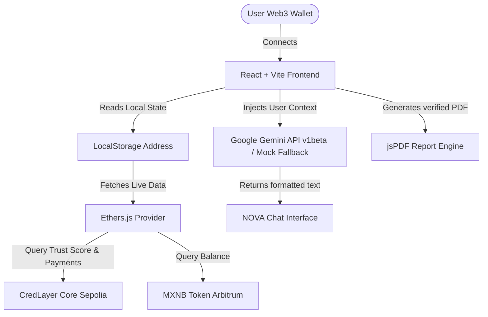

# CredLayer AI

## Portable Financial Reputation Infrastructure for LATAM
**Built for Ethereum México Hackathon**

---

# Overview

CredLayer AI is a financial intelligence and portable reputation platform designed for small businesses, freelancers, and informal commerce communities across LATAM.

The platform transforms everyday financial activity into a verifiable and portable financial reputation using Ethereum infrastructure, stablecoins, and AI-powered analytics.

Instead of replacing banks, CredLayer AI creates an alternative trust layer for people traditionally ignored by the financial system. The user experience is designed to feel like a modern fintech platform while Web3 and AI infrastructure work seamlessly in the background.

---

# Core Vision

> **"CredLayer AI turns everyday financial activity into portable trust."**

The goal is to help millions of people and small businesses in LATAM prove financial stability, operational consistency, and economic activity through blockchain-backed verification and AI analysis.

---

# Platform Summary & Features

### 1. Verifiable Payment Records
* **Invoice Registry**: Users can register incoming and outgoing business payments.
* **On-Chain Attestations**: Transaction verification hashes are committed on-chain.
* **Interactive Log**: A detailed history table displays gas usage, block height, transaction confirmations, and direct verification links to Etherscan.
* **Supported Assets**: **USDC** (Ethereum Sepolia) and **MXNB** (Mexican Peso stablecoin on Arbitrum Sepolia).

### 2. Upgraded NOVA AI Assistant (100% Operational)
An intelligent financial copilot integrated as a standalone page (`/nova`) and a persistent slide-over chat widget (`<AIAssistantChat />`).
* **Hybrid Execution Engine**:
  * **Live Mode**: Directly connects to the **Google Gemini API (`gemini-2.5-flash`)** for cost-efficient, high-performance, real-time responses.
  * **Local Simulation Mode**: Automatically detects missing or placeholder keys (like `YOUR_GEMINI_API_KEY`) or `VITE_DEMO_MODE=true` in `.env` to execute a local mock solver (`buildMockReply`). This queries actual smart contract data and Arbitrum token balances to generate accurate financial answers.
  * **Fail-Safe Fallback**: If a live request fails (expired key, network down), it catches the exception, updates the dashboard error warning, and immediately generates a mock reply, ensuring the assistant is **never broken** during live demo presentations.
* **Context-Aware Insights**: Dynamically reads real-time data directly from the **CredLayer Core** contract (Trust Scores, payment counts) and Arbitrum MXNB tokens.
* **Rich Markdown Parsing**: Fully supports formatting (bold, italic, list items, highlights) in chat bubbles.

### 3. Web3 Microloans & Dynamic NFTs
* **Community Funding (Lending)**: P2P lending system where users can fund active community credit requests using USDC and receive a dynamic "Backer NFT Certificate" in return.
* **Credit Requests (Borrowing)**: Configure custom terms (principal, rate, term, purpose) to mint a representative **Reputation-Credit NFT**.
* **Interactive 3D Preview**: Displays a beautiful Credit Card NFT with a 3D mouse-tilt parallax and glare visual effect.
* **Repayment & Network Switching**: Repay loans in USDC or MXNB. If paying in MXNB, the app automatically prompts MetaMask to switch to the **Arbitrum Sepolia** network. On-time repayments automatically boost on-chain reputation scores.
* **Live Support Ticker**: A scrolling horizontal banner showcasing real-time community sponsorships.

### 4. Interactive Community Portal
* **Kinetic Background Canvas**: A premium floating particle grid background animating in response to mouse movement.
* **Animated Statistics**: Stats counters (Active Members, Funded Volume, Active Nodes, Gas Saved) dynamically count up when scrolled into view.
* **Interactive Onboarding Pipeline**: A multi-step setup flow guides users through connecting wallets, registering a custom ENS subdomain (`*.micro.eth`), choosing interest tags, and completing registration.
* **Trending Discussions Board**: A forum-style list displaying community ideas, reputation of authors, and replies.
* **Bento Grid layout**: Showcases featured community cooperatives (CulturaChain Collective, Cooperativa Milpa Alta, ENS Reputation Layer).

### 5. Verifiable PDF Reports
Allows exporting professional financial reports with:
* Current on-chain Trust Score and verified payment volume.
* Verified contract deployment address on Ethereum Sepolia.
* Direct link to the **CredLayer Core** contract on Etherscan for third-party validation.

---

# 🚀 Smart Contract Deployments (Live)

CredLayer AI is fully operational on testnets. All reputation data and payments are stored immutably on-chain.

* **CredLayer Core (Ethereum Sepolia):** [`0xcABFB7d02e1C32F2a26FFa244F1B1ba53f920431`](https://sepolia.etherscan.io/address/0xcABFB7d02e1C32F2a26FFa244F1B1ba53f920431)
* **USDC Stablecoin (Ethereum Sepolia):** [`0x1c7D4B196Cb0C7B01d743Fbc6116a902379C7238`](https://sepolia.etherscan.io/address/0x1c7D4B196Cb0C7B01d743Fbc6116a902379C7238)
* **MXNB Token (Arbitrum Sepolia):** [`0xf197ffc28c23e0309b5559e7a166f2c6164c80aa`](https://sepolia.etherscan.io/address/0xf197ffc28c23e0309b5559e7a166f2c6164c80aa)
* **Sepolia Public RPC Node:** `https://ethereum-sepolia-rpc.publicnode.com` (with CORS enabled for seamless dApp requests)

---

# 🏗️ Technical Architecture

```mermaid
graph TD
    User([User Web3 Wallet]) -->|Connects| Frontend[React + Vite Frontend]
    Frontend -->|Reads Local State| WalletStore[LocalStorage Address]
    WalletStore -->|Fetches Live Data| Ethers[Ethers.js Provider]
    Ethers -->|Query Trust Score & Payments| SepoliaContract[CredLayer Core Sepolia]
    Ethers -->|Query Balance| MXNBToken[MXNB Token Arbitrum]
    Frontend -->|Injects User Context| GeminiAPI[Google Gemini API v1beta / Mock Fallback]
    GeminiAPI -->|Returns formatted text| NovaUI[NOVA Chat Interface]
    Frontend -->|Generates verified PDF| jsPDF[jsPDF Report Engine]
```

---

# 🛠️ Tech Stack

* **Frontend:** React + Vite + Vanilla CSS / Tailwind CSS
* **Blockchain:** Wagmi + Ethers.js v6 + Viem
* **Artificial Intelligence:** Google Gemini API (`gemini-2.5-flash`) with automatic local simulation fallback
* **UX/Animations:** GSAP + Lenis Smooth Scroll + Framer Motion + Anime.js + Canvas API
* **Reporting:** jsPDF

---

# 📋 Progress & Roadmap (To-Do)

### Completed (100% Operational)
* [x] **Smart Contract Deployments:** CredLayer Core, USDC, and MXNB integrated.
* [x] **Real-time Web3 Reads:** NOVA dynamically queries trust scores and balances based on the active wallet.
* [x] **Hybrid AI Engine:** Upgraded `useAiAssistant` to support offline simulations if the API Key is a placeholder, and catch errors to fallback gracefully.
* [x] **NOVA React Page:** Created `/nova` route and UI using the custom AI hook.
* [x] **Onboarding Workflow**: Implemented onboarding, ENS registration, and interest choices.
* [x] **3D Card FX**: Added mouse tilt/glare parallax animations to the credit card preview.
* [x] **Repayment MetaMask Integration**: Implemented network switching code for paying with MXNB on Arbitrum Sepolia.

### Next Steps / Missing Features (Gap Analysis)
* [ ] **On-Chain Subdomain & Loan Writes**: Migrate the subdomain registration and credit creation/repayment methods from simulated transactions to real contract writes on Scroll / Arbitrum.
* [ ] **Arbitrum Stylus Contracts**: Port the reputation scoring algorithms and loan ledger code to Rust using Arbitrum Stylus to dramatically lower execution gas fees.
* [ ] **Account Abstraction & Gasless Transactions**: Integrate paymasters (ERC-4337) to sponsor transaction gas fees, making the experience fully gasless for LATAM merchants.
* [ ] **i18n Localization**: Implement unified language translation (English/Spanish/Portuguese) for regional target audiences.
* [ ] **Progressive Web App (PWA) Support**: Package the web application so informal merchants can install and run it as an app on Android devices.
* [ ] **EIP-3668 (CCIP Read)**: Enable CCIP read resolution for registered `.micro.eth` subdomains, allowing them to resolve natively on Metamask and other wallets.
